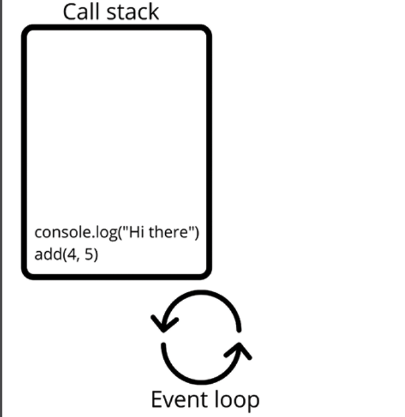
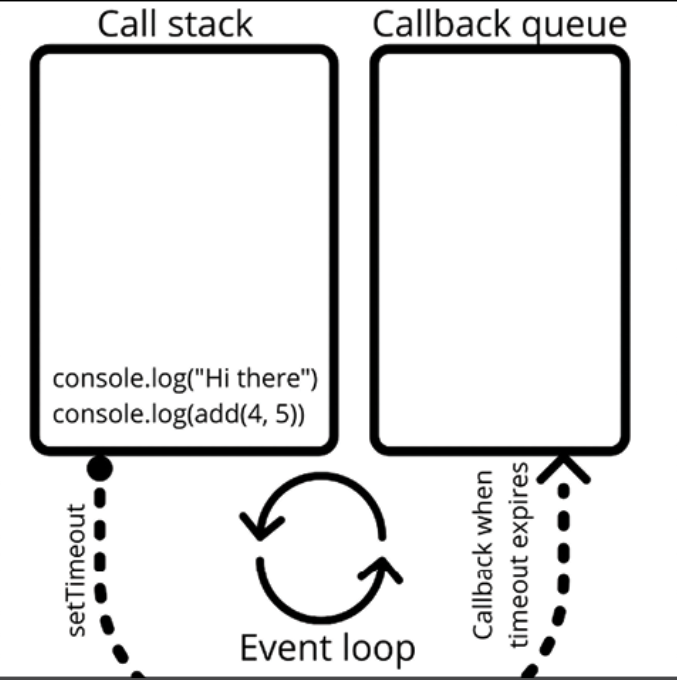
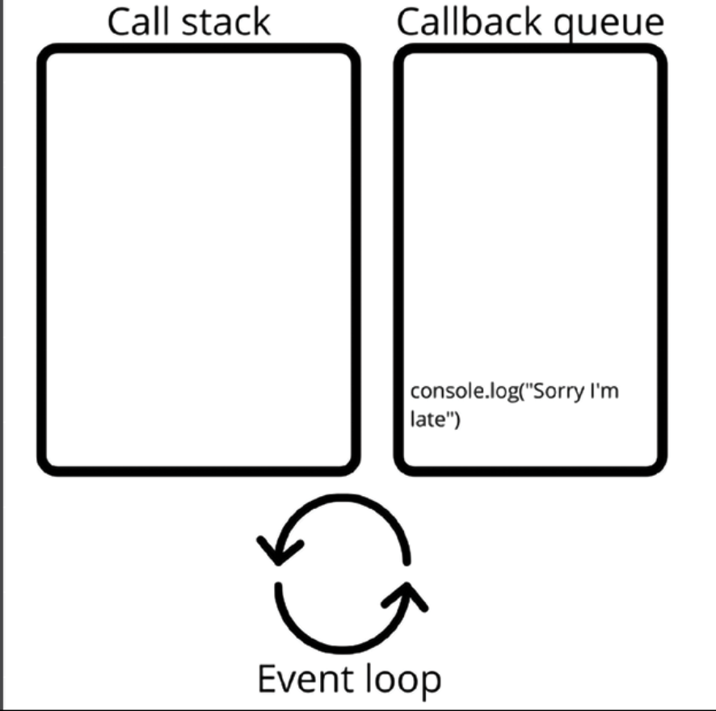

# Event Loop 

→ JS is a single threaded language

→ "Thread" in this context means a path of execution. If there is only a single path, this means that tasks will have to wait for one another and only one thing can happen at a time

→ This single executor is called the "event loop". Even though JavaScript is single-threaded, it doesn't mean that it cannot outsource some tasks and wait for them to come back. 

→ This is exactly how JavaScript manages to do things in a multithreaded manner

## Call Stack and Callback Queue

→ JS works with a "call stack", and all the actions that it has to execute are queued up here. 

→ The event loop is a process that is constantly monitoring this "call stack", and whenever there are tasks to do, the event loop does them one by one

→ The tasks on top get executed first

→ Example:

    console.log("Hi there");
    add(4,5);
    function add(x, y) {
        return x + y;
    }

    

→ Example:

    console.log("Hi there");
    setTimeout(() => console.log("Sorry I'm late"), 1000);
    console.log(add(4, 5));
    function add(x, y) {
        return x + y;
    }

    → The setTimeout() task gets outsourced to the browser's web API. When 
      it's done, this appears in a special place: the "callback queue" 
    
    → When the call stack is empty (and only then!), the event loop will check the  "callback queue" for work to do. 
      If there are any callbacks waiting, they'll be executed, one by one. 
    
    → After every action, the event loop will check the "call stack" for work first

    → When setTimeout() expires, the event loop will have done whatever was 
      on the call stack already, and will check the callback queue and execute 
      any tasks on there

    → Output: Hi there

              9

              Sorry I'm late

    

    

→ Tricky Example:

    console.log("Hi there");
    setTimeout(() => console.log("Sorry I'm late"), 0);
    console.log(add(4, 5));
    function add(x, y) {
        return x + y;
    }

    → setTimeout() will also be outsourced when the timer is at 0. The
      callback is placed in the callback queue right away,
    
    → The event loop won't even check the callback queue until the callstack 
      is empty. So it will still print Sorry I'm late after 9, even though 
      the timer is at 0

    → Output: Hi there

              9

              Sorry I'm late

    

