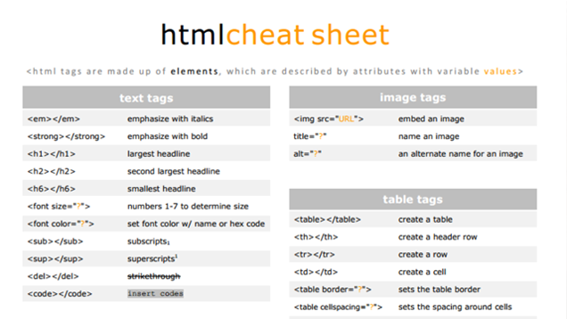

→# The Document Object Model (DOM) grabs an HTML page and turns it into a logical tree.

    → DOM contains all the HTML elements on a page.

    → With JS, we can select and manipulate parts of the DOM.

→ The Browser Object Model (BOM) holds all the methods and properties for JS to interact with the browser

## HTML Crash Course

→ HTML is a language that shapes the content of web pages

→ HTML code consists of elements
    
    → Elements contain a tag and attributes

### HTML Elements

→ Elements are words between < angle brackets >
→ Any element that gets opened needs to be close

    → Open: <elementName>
    → Close: </elementName>

→ Everything in between the openeing and closing tags is part of that element

→ Elements can contain inner elements

    → Elements can only be closed if all inner elements have been closed

→ Different elements represent different pieces of layout

    → p represents paragraphs
    → h1 represents a big heading
    → h2 is a smaller title

→ There are three major building elements of every HTML page:

    → 1) HTML element
    → 2) head element
    → 3) body element

### 1) HTML element

→ All the HTML takes place in the HTML element

→ Only have one of these in an HTML page

→ It is the outer element; all other elements are housed in it

→ Contains the other two top level elemens; head and body 

### 2) head element

→ Arrange a lot of things that are meant for the browser and not for the user

→ Contains certain metada:

    → JS script  and CSS stylesheets 

    → <title> </title> defines the title of the browser

### 3) body element

→ Contains the content that will appear on the web page

→ One body element in the HTML element

→ We can come across a lot of elements in the body element: 

    → Headings <h1> </h1>

    → Paragraphs 
 

    → Images 

    → Lists <li> </li>

    → Links  

    → Buttons <button></button>

    → Divisions (Used as a container for other style or sections and can easily be ised for special layouts) 

 

    

