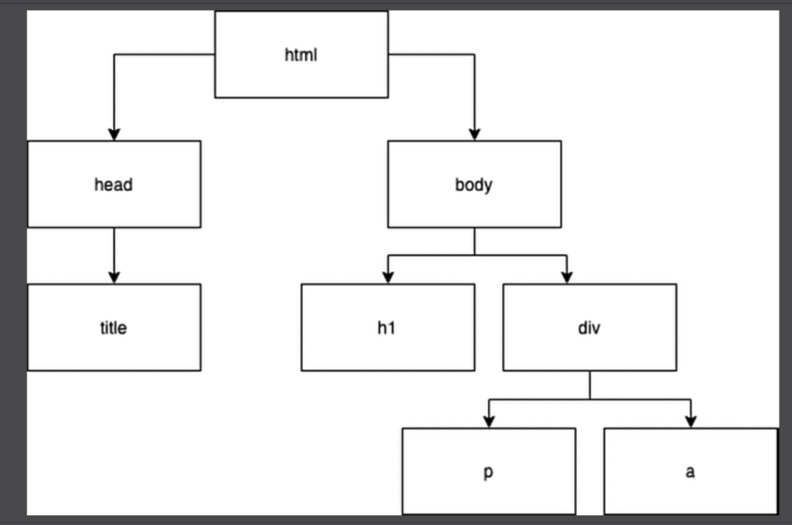

# Document Object Model (DOM)

→ The DOM is a way of displaying the structure of an HTML document as a logical tree

        → Possible because of the very important rule that inner elements need to be closed before outer elements get closed

        → Elements are nodes within this tree

       → When a web page is loaded, the browser creates a Document Object Model of the page

        

Ex: 
```
<html>
  <head>
    <title>Tab in the browser</title>
  </head>
  <body>
    <h1>DOM</h1>
    <div>
      <p>Hello web!</p>
      <a href="https://google.com">Here's a link!</a>
    </div>
  </body>
</html>

```

<p align="center">
    
</p>


